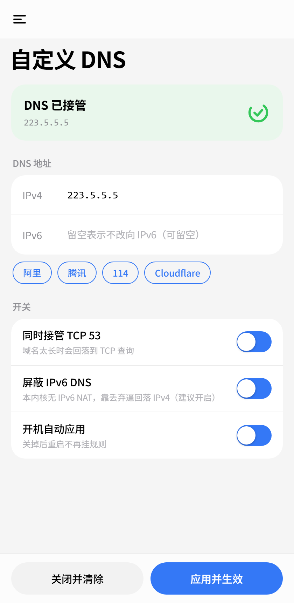

# 自定义 DNS（Android）

[](https://github.com/TianyiTwT/dns-modifier-kernelsu/actions/workflows/build.yml)
[](LICENSE)

在 WebUI 里填两个 DNS 地址，全系统的明文 DNS 查询即改走它们。
KernelSU / Magisk 模块，无常驻进程，应用后立即生效。



## 工作原理

Android 10 起，系统没有设置解析器的公开接口，常见路径均不可用：

| 方式 | 结果 |
| --- | --- |
| `setprop net.dns1` / `net.dns2` | netd 已不再读取 |
| `ndc resolver setnetdns` | 命令已移除（Android 16 返回 `500 0 Command not recognized`） |
| netd resolver AIDL | 受 `NETWORK_STACK` 保护，root shell 无法调用 |

模块改写的是包的流向：在 `nat/OUTPUT` 上把目的端口 53 的流量重定向到指定地址。

```sh
iptables -t nat -N DNSMOD
iptables -t nat -A DNSMOD -d 127.0.0.0/8 -j RETURN
iptables -t nat -A DNSMOD -p udp --dport 53 -j DNAT --to-destination <ipv4>:53
iptables -t nat -A DNSMOD -p tcp --dport 53 -j DNAT --to-destination <ipv4>:53
iptables -t nat -A OUTPUT -j DNSMOD
```

使用 DNAT 而非 REDIRECT：DNAT 直接改写目的地，应答由目标服务器返回，本机不需要
任何进程监听；REDIRECT 的终点是本机端口，必须额外运行 dnsmasq 或 dnscrypt-proxy。

规则挂在 `OUTPUT` 上，只作用于本机发出的查询，不影响 adb、WebUI、热点转发与
其它容器。链内第一条为回环豁免，避免把本机自身的查询卷入。

## 环境要求

- Android 10 及以上
- 内核的 `iptables` 含 `nat` 表
- KernelSU / SukiSU / ReSukiSU / Magisk（WebUI 依赖 KernelSU 系管理器）

## 安装

从 Release 下载 zip，在管理器里安装后重启；或用命令行：

```sh
adb push dns-modifier-v0.1.0.zip /data/local/tmp/
adb shell su -c 'ksud module install /data/local/tmp/dns-modifier-v0.1.0.zip'
```

安装后默认为未接管状态（`enable=0`）。规则在首次点击「应用并生效」或开机自启时
才会挂上，安装本身不改变任何 DNS 行为。

## 使用

打开模块的 WebUI，填入 IPv4 DNS，IPv6 可留空，点「应用并生效」。页面提供阿里、
腾讯、114、Cloudflare 的快捷填充。

系统的「设置 → 网络和互联网 → 私人 DNS」需要关闭：DoT 走 853 端口，本模块管不到。

## 配置

配置文件位于 `/data/adb/dns-modifier/config.conf`，权限 0600。

```ini
ipv4=223.5.5.5    # DNS 地址，必填
ipv6=             # 可留空
tcp=1             # 是否同时接管 TCP 53
block6=1          # 丢弃 IPv6 DNS，迫使解析器回落 IPv4
autostart=1       # 开机自动应用
enable=1          # 0 = 已关闭
```

### 命令行

```sh
S=/data/adb/modules/dns-modifier/scripts/dns-apply.sh

sh $S status                # 输出 key=value 状态
sh $S use ipv4=1.1.1.1      # 校验 + 保存 + 立即生效
sh $S save ipv4=1.1.1.1     # 只校验并保存，不改动现有规则
sh $S apply                 # 按当前配置重新挂规则
sh $S off                   # 摘掉规则，保留配置
sh $S disable               # 摘掉规则并取消开机自启
```

模块卡片的「操作」按钮输出 `status` 的可读版本。

## 关闭与恢复

填错 DNS 时，在 WebUI 点「关闭并清除」，或执行：

```sh
sh /data/adb/modules/dns-modifier/scripts/dns-apply.sh disable
```

规则只挂在 `OUTPUT` 上，不影响 adb 与 WebUI，因此该操作总能执行。关闭状态会落盘，
重启后不会自动恢复。

## 已知限制

- 只接管明文 DNS（UDP / TCP 53）。系统「私人 DNS」走 DoT（853），应用内置的 DoH
  走 443，两者均绕过本模块。
- 部分机型的内核没有 `ip6tables` 的 `nat` 表（K30 Pro / Android 16 报
  `Table does not exist`），IPv6 查询无法改写目的地，只能由 `block6` 丢弃，
  使解析器回落到 IPv4。脚本启动时会探测，不支持的情况在 WebUI 中说明。
- 系统不知道 DNS 已被改写。地址不会写入 `LinkProperties`，应用通过 API 读到的
  仍是运营商下发的值。
- DNS 不通时系统可能判定该网络无 Internet 并切换到其它网络。此时规则仍然生效，
  只是走的不是你预期的那条链路。

## 目录结构

```
.
├── build.sh                   # 打包（纯 shell 模块，无编译步骤）
├── docs/webui.png
└── module/                    # 打进 zip 的内容
    ├── module.prop
    ├── customize.sh           # 安装 / 升级
    ├── service.sh             # 开机自启（late_start service）
    ├── action.sh              # 模块卡片的「操作」按钮
    ├── uninstall.sh
    ├── scripts/dns-apply.sh   # 规则的唯一入口
    └── webroot/
        ├── index.html
        ├── app.js
        ├── style.css
        ├── kernelsu.js        # KernelSU WebUI 桥的薄封装
        └── dev-preview.html   # 开发预览页，不进模块包
```

## 构建

```sh
sh build.sh              # 产物 dist/dns-modifier-<version>.zip
sh build.sh --install    # 打包后用 adb + ksud 装到设备
```

zip 的根目录即模块内容（`module.prop` 位于最外层）。`build.sh` 会先做行尾自检：
脚本中混入 CR 会直接失败，因为 CRLF 的 shebang 在设备上无法执行。

### 持续集成

`.github/workflows/build.yml` 在推送 `main`、Pull Request 与手动触发时打包，产物
在对应 run 的 Artifacts 中下载。CI 会顺带校验 zip 的结构（`module.prop` 位于最外层、
开发预览页未被打入），并拦住任何混入 CR 的脚本。

推送 `v*` tag 时额外创建 Release 并把 zip 挂上去。发版流程：

```sh
sed -i 's/^version=.*/version=v0.2.0/' module/module.prop
sed -i 's/^versionCode=.*/versionCode=2/' module/module.prop
git commit -am "v0.2.0"
git tag v0.2.0
git push origin main --tags
```

tag 与 `module.prop` 中的版本不一致时 CI 直接失败，不会发出版本号对不上的包。

## 卸载

在管理器里卸载。`uninstall.sh` 会先摘掉规则，避免残留无人管理的 iptables 链。

## 许可

BSD-3-Clause，见 [LICENSE](LICENSE)。
